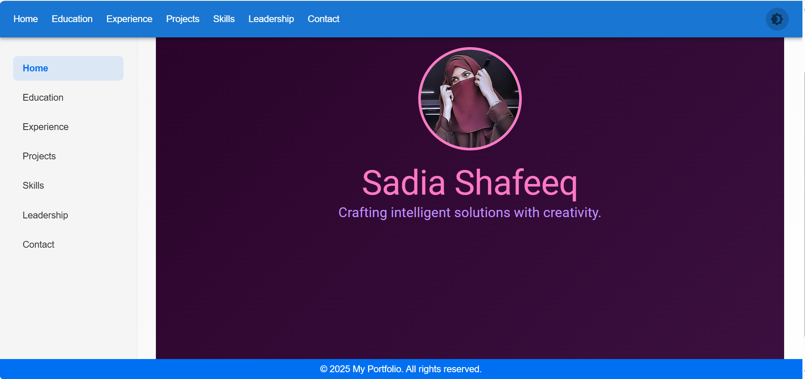
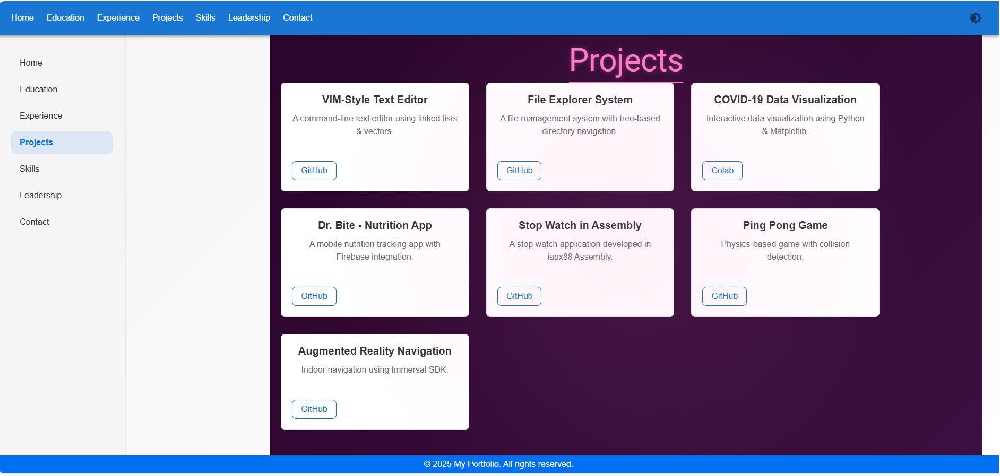
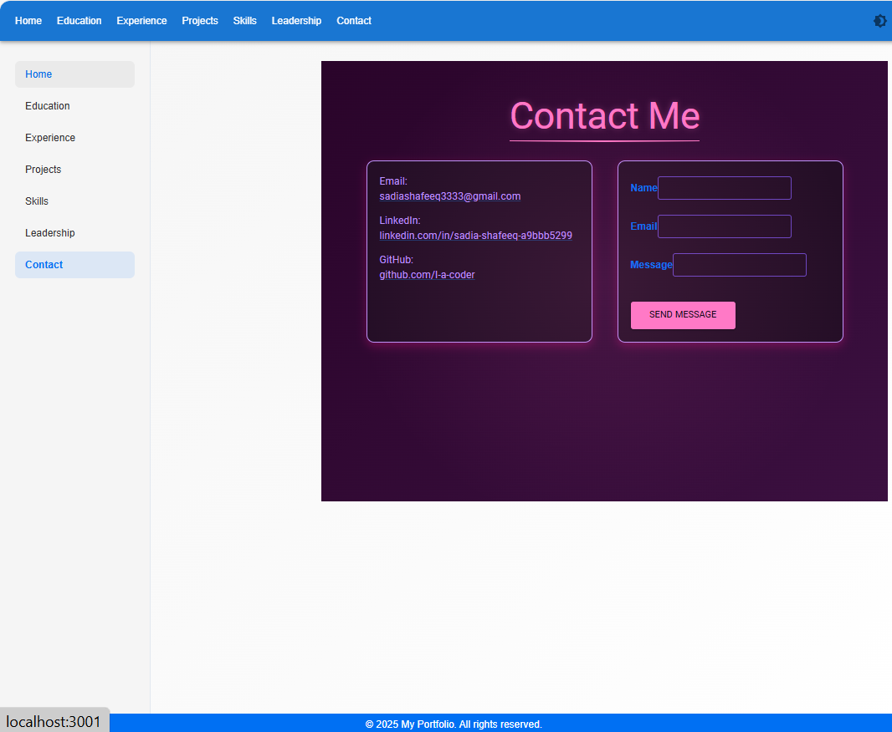
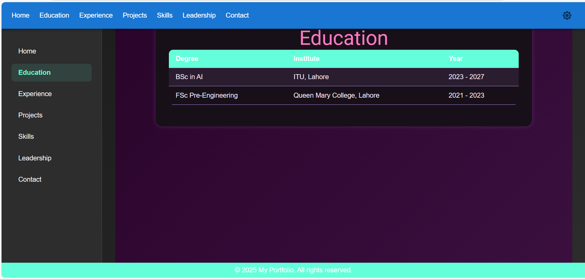
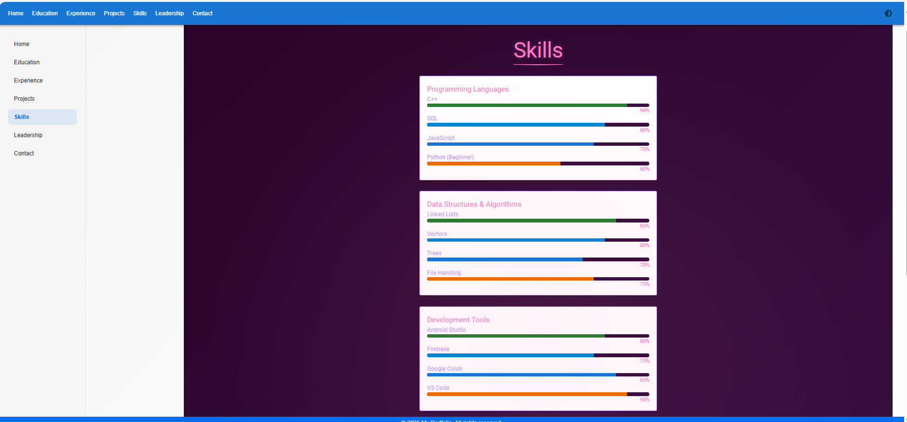
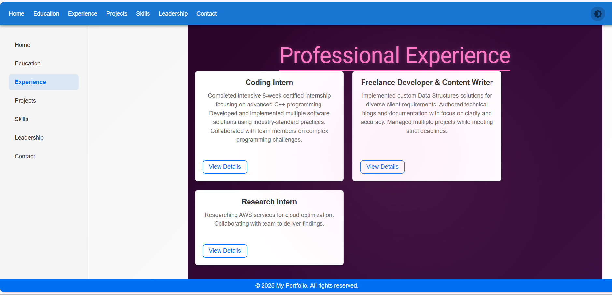

#  React CSS Portfolio

A beginner-friendly personal portfolio built using **React** and **CSS**. It includes multiple sections like About, Projects, and Contact — fully customizable to showcase your own work and skills.

---

##  Screenshots

###  Home Page

###  Projects Page

###  Contact Page

###  Education Page

###  Skills Page

### Experience Page

##  Tech Stack

- ⚛ React
-  CSS
-  Git & GitHub

